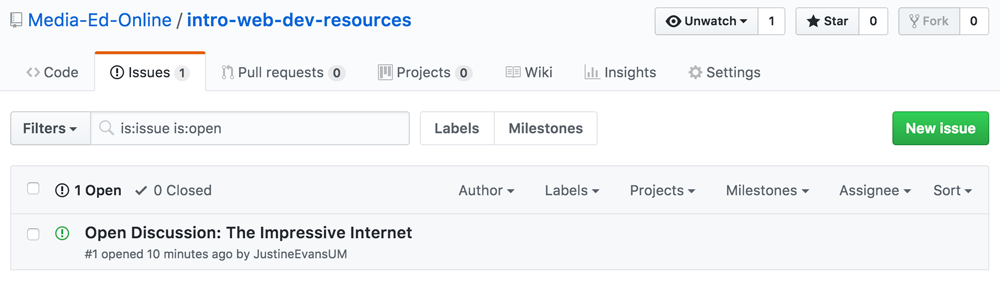
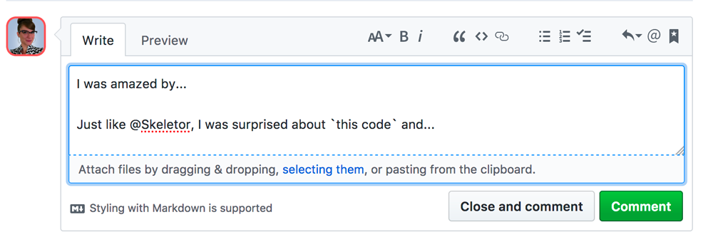
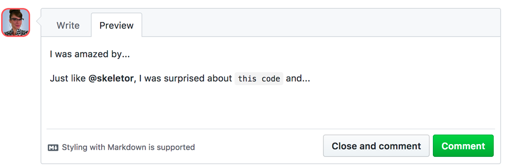

The absolute best way to ask for help in this course is to utilize the <a href="{{ site.git_address }}-resources/issues/">Issues board</a> feature. This is ideal because:

1. Everyone has access to your question, and can help respond.
2. It is easier for your instructor to reply to Issues than to e-mails.
3. Neat-O If you push changes to GitHub, your instructor has access to your code and can provide _specific_ solutions, when/where/how directly into your site code.

## Contributing
As the semester goes on you will be expected to open issues when you are having problems.

<ul class="nav nav-tabs">
  <li class="active"><a href="#step1" data-toggle="tab">Step 1</a></li>
  <li><a href="#step2" data-toggle="tab">Step 2</a></li>
  <li><a href="#step3" data-toggle="tab">Step 3</a></li>
  <li><a href="#step4" data-toggle="tab">Step 4</a></li>
</ul>

  

    
Step 1: Go to the course's Resource repo either by clicking <a href="{{ site.git_address | append: "-resources/issues/" }}" target="_blank">this link</a> or the GitHub octocat logo (<i class="fab fa-github" aria-hidden="true"></i>) from the navigation menu above.

    
Note A good specific Issue to experiment with is <a href="https://github.com/Media-Ed-Online/intro-web-dev-resources/issues/1" target="_blank">“The Impressive Internet”</a>.

  

  

    
Step 2: Simply click on an issue to access it. Open issues are labeled with a green exclamation point. <i class="fas fa-exclamation" style="border: 2px solid #38B44A; border-radius: 20px; color: #38B44A; width: 16pt; height: 16pt; padding: 2px 6px;" aria-hidden="true"></i>

    
  

  

    
Step 3: Type in the active dialogue box to share your reply.

    
    
Note Highly-active posts may have a lot of replies, and you'll have to scroll to the bottom of the page to add your own.

  

  

    
Step 4: You can use Markdown in these Issues, and preview it before commenting by selecting the tab.

    
  

