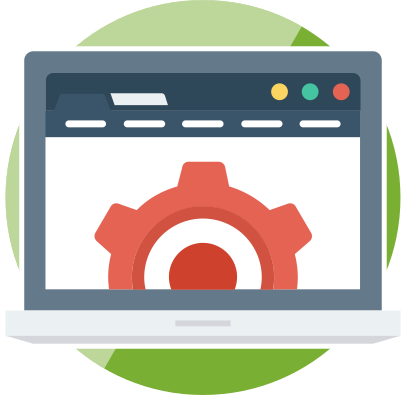

<h2 style="text-align: center;">02: Your Development Environment</h2>

In the first Topic we spent time with an overview of this course itself, the internet, the web, and what a web developer is. This Topic will build on these ideas by introducing our course development environment and more of the tools that you'll use throughout your time here.

By the end of this Topic, we hope you:
- Understand the importance of well-organized and -labeled files in web development.
- Set up a proper folder/directory system for your future homework.
- Experimented with performing, tracking, and visualizing changes to files between your local drive and GitHub.
