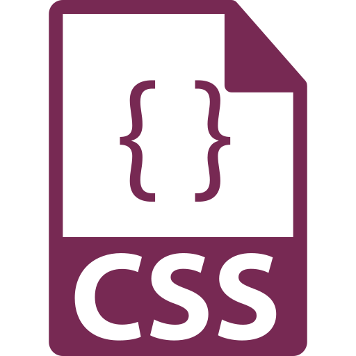

Web designers use all types of files to create sites, from `.html` to `.css` to `.php` and dozens of others. How files are created and saved will affect how they are processed; a `.css` file will not have the same capabilities of a `.html` file, and vice versa.

### Common File Types Used in Web Design
<ul class="nav nav-tabs">
  <li class="active"><a href="#web-pages" data-toggle="tab">Pages</a></li>
  <li><a href="#web-images" data-toggle="tab">Images</a></li>
  <li><a href="#web-av" data-toggle="tab">Audio & Video</a></li>
  <li><a href="#web-scripts" data-toggle="tab">Scripts</a></li>
</ul>

  

    
Pages are the most common inclusion in a web site, simply because pages contain the visible content of that site. Further files (such as images and other media) will most-likely be accessed from pages, through hyperlinks, embeds, and the like.

    

    

      

        
        
page.html

      

      

        <h4>Hypertext Markup Language (<b>HTML</b> or <b>HTM</b>)</h4>
        
HTML is the standard language known by all web designers and developers. HTML provides the structure of the page, using <i>elements</i> to create headings, paragraphs, lists, tables, links, etc. Properly-laid-out HTML is designed to enhance accessibility, and provide structued content outside of decorative styling.

        <h4>Pros and Cons of Use:</h4>
        <ul style="list-style-type: none">
          <li class="icon-pro">Widely-used; standard.</li>
          <li class="icon-pro">Easy-to-learn.</li>
          <li class="icon-pro">Extensive; has a large library and support community.</li>
          <li class="icon-con">Requires a browser to correctly interperet the code.</li>
          <li class="icon-con">HTML Lexicon is in American English, and may require extra interpretation for non-English speakers.</li>
        </ul>
      

    

    

    

      

        
        
page.css

      

      

        <h4>Cascading Style Sheet (<b>CSS</b>)</h4>
        
CSS is used to control how the page looks and functions. CSS is used to “decorate” the site; this is, provide layout, color, interactive elements, fonts, and other formatting. While HTML provides the contents of the page, CSS specifies to the browser how the site will look. Using a stylesheet greatly speeds up development time, as a single sheet can affect all pages in the site.

        <h4>Pros and Cons of Use:</h4>
        <ul style="list-style-type: none">
          <li class="icon-pro">Speed and consitancy in styling site pages.</li>
          <li class="icon-pro">Supported by nearly all browsers.</li>
          <li class="icon-pro">Extensive; has a large library and support community.</li>
          <li class="icon-con">CSS syntax is different from HTML, and requires users to learn both languages.</li>
          <li class="icon-con">Browsers interpret CSS differently; stylesheets often need to add additional code to make sure the site renders as intended in all situations.</li>
        </ul>
      

    

    

    

      

        
        
page.php

      

      

        <h4>Hypertext Preprocessor (<b>PHP</b>)</h4>
        

        <h4>Pros and Cons of Use:</h4>
        <ul style="list-style-type: none">
          <li class="icon-pro"></li>
          <li class="icon-con"></li>
        </ul>
      

    

  

  

    
Images are the media lifeblood of web design. Sites can contain many images in different file types, and how that image will be used dictates what file type it should be, and vice versa.

    

    

      

        
        
image.jpg

      

      

        <h4>Joint Photographic Experts Group (<b>JPEG</b> or <b>JPG</b>)</h4>
        
The JPEG is the most-utilized image format in digital publishing. JPEGs can be compressed to low-, medium, and high-quality and, because of this, can showcase images on screens at relatively small file sizes without sacrificing the integrity of the image. File types like JPG, PNG, and GIF are “rastered” and have defined dimensions. This means the image will lose quality when resized, and should not be manipulated beyond its original dimensions (width and height).

        <h4>Pros and Cons of Use:</h4>
        <ul style="list-style-type: none">
          <li class="icon-pro">Good for photographs, artwork, or other detailed images.</li>
            <li class="icon-pro">When the image has many colors.</li>
            <li class="icon-pro">Medium to small file size.</li>
            <li class="icon-con">Rastered file.</li>
        </ul>
      

    

    

    

      

        
        
image.png

      

      

        <h4>Portable Network Graphics (<b>PNG</b>)</h4>
        
PNGs allow for transparency, an important tool in graphic and web design. Unlike JPGs, there is no compression with PNGs; these files will not lose quality when saved. However, this means PNGs are a rather large file type, and should be used sparingly or on small images.

        <h4>Pros and Cons of Use:</h4>
        <ul style="list-style-type: none">
          <li class="icon-pro">Good for graphics like logos and icons.</li>
          <li class="icon-pro">When the image has areas of full- or partial-transparency (like drop shadows).</li>
          <li class="icon-con">Large file size.</li>
          <li class="icon-con">Rastered file.</li>
        </ul>
      

    

    

    

      

        
        
image.gif

      

      

        <h4>Graphics Interchange Format (<b>GIF</b>)</h4>
        
Similar to PNGs, GIFs have certain properties that allow for image effects. This format is most-often attributed to animated files, as it allows for several consecutive frames to be included in a single image file. Due to this, GIFs can be quite large, and may require heavy compression to be feasible in site design.

        <h4>Pros and Cons of Use:</h4>
        <ul style="list-style-type: none">
          <li class="icon-pro">Required for animamted images.</li>
          <li class="icon-pro">Good for simple icons with low-color density (few colors).</li>
          <li class="icon-con">Large file size.</li>
          <li class="icon-con">Rastered file.</li>
        </ul>
      

    

    

    

      

        
        
image.svg

      

      

        <h4>Scalable Vector Graphics (<b>SVG</b>)</h4>
        
SVGs are an integral component of web design. SVGs, as stated in their name, are scaleable and can be manipulated and styled without sacrificing quality or file size. SVGs are, in effect, “drawn” by the browser in that they are actually packets of coordinates written in a markup language (XML, or Extensible Markup Language). This code is editable, and SVGs can have colors, effects, and animations applied to them.

        <h4>Pros and Cons of Use:</h4>
        <ul style="list-style-type: none">
          <li class="icon-pro">Good for vector graphics like logos and icons.</li>
          <li class="icon-pro">Resolution-independent.</li>
          <li class="icon-pro">Minipulating does not change file size.</li>
          <li class="icon-con">Not good for detailed images, or beyond 2D needs.</li>
          <li class="icon-con">Requires an understanding on how to properly use and impliment the code.</li>
        </ul>
      

    

  

  

    
test

    

      

        
        
song.mp3

      

      

        <h4>Title (<b>MP3</b>)</h4>
        

        <h4>Pros and Cons of Use:</h4>
        <ul style="list-style-type: none">
          <li class="icon-pro"></li>
          <li class="icon-con"></li>
        </ul>
      

    

    

    

      

        
        
song.ogg

      

      

        <h4>Title (<b>OGG</b>)</h4>
        

        <h4>Pros and Cons of Use:</h4>
        <ul style="list-style-type: none">
          <li class="icon-pro"></li>
          <li class="icon-con"></li>
        </ul>
      

    

    

    

      

        
        
video.mp4

      

      

        <h4>Title (<b>MP4</b>)</h4>
        

        <h4>Pros and Cons of Use:</h4>
        <ul style="list-style-type: none">
          <li class="icon-pro"></li>
          <li class="icon-con"></li>
        </ul>
      

    

    

    

      

        
        
video.webm

      

      

        <h4>Title (<b>WebM</b>)</h4>
        

        <h4>Pros and Cons of Use:</h4>
        <ul style="list-style-type: none">
          <li class="icon-pro"></li>
          <li class="icon-con"></li>
        </ul>
      

    

  

  

    
test

    

      

        
        
script.js

      

      

        <h4>JavaScript (<b>JS</b>)</h4>
        

        <h4>Pros and Cons of Use:</h4>
        <ul style="list-style-type: none">
          <li class="icon-pro">Easy-to-learn and use.</li>
          <li class="icon-pro">Incredibly popular; wide-usage with community knowledgebase.</li>
          <li class="icon-pro">Verisitle. Basic JS can be used inline in HTML, and developing entire applications.</li>
          <li class="icon-con">Because the code executes on the client's computer, it can be a security risk.</li>
          <li class="icon-con">Interpreted differenly across browsers; requires testing.</li>
        </ul>
      

    

    

    

      

        
        
script.cgi

      

      

        <h4>Common Gateway Interface (<b>CGI</b>)</h4>
        

        <h4>Pros and Cons of Use:</h4>
        <ul style="list-style-type: none">
          <li class="icon-pro"></li>
          <li class="icon-con"></li>
        </ul>
      

    

    

    

      

        
        
script.asp

      

      

        <h4>Active Server Page (<b>ASP</b>)</h4>
        

        <h4>Pros and Cons of Use:</h4>
        <ul style="list-style-type: none">
          <li class="icon-pro"></li>
          <li class="icon-con"></li>
        </ul>
      

    

  

 

Neat-O Most file types and their languages are designed to work _together,_ not singularly, and need to be directed to each other.
