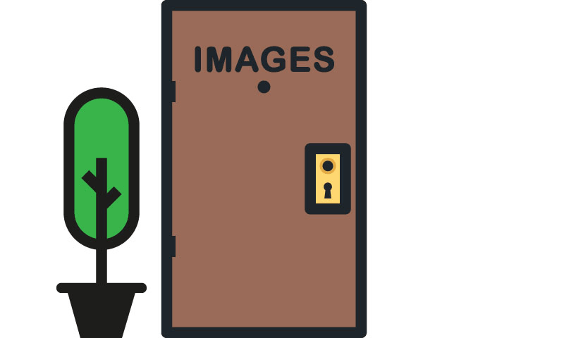

Generally, we can think about “finding” a web location in one of two ways: via its _relative_ or _absolute_ address (or URL). Let's create a scenario to start.

  
  
Consider the file “profile.jpg”

## Absolute URLs

<i class="fas fa-long-arrow-alt-right" style="color: #20B5E9"></i> **https://www.example.com/about/images/profile.jpg**

An **absolute URL** contains all of the protocols and information for the file's location. If I am the owner of **www.another-example.com** and I want to link to "profile.jpg" I will need it's absolute URL (https://www.example.com/about/images/profile.jpg) as it lives on a separate site than mine.

We can compare this to needing to know the city, street, building, and apartment number of "profile.jpg" because we live in a different part of town.

## Relative URLs

**Relative URLs** contain no protocols or domain information. This is convenient because they are shorter, but can _only_ reference files in the same path. If I am the owner of **www.example.com** and am embedding "profile.jpg" on my About page, I can do so relatively with "./images/profile.jpg" as long as the images folder is in the same path as my page. I do not need an absolute URL.

The "." is a path component stating that we need to remain in the current level of our directory hierarchy. Effectively, it says _"to find this file, begin here and then head down inside the images folder, where you'll find profile.jpg."_

To continue our analogy, since I'm already inside the same building as "profile.jpg," I only need its apartment number to find it.

This will be handy for you as you start to link to your own images within your repo.
