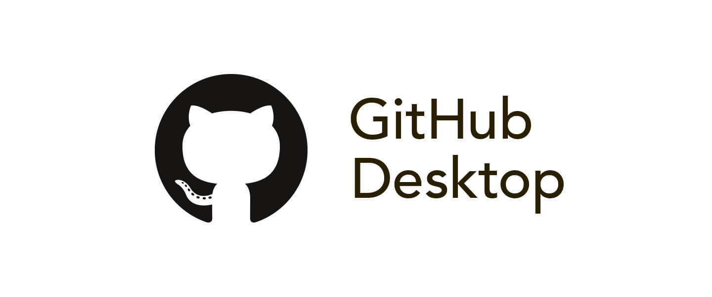

## GitHub Desktop App (Simple Development from your Desktop)
This application is a "GUI" (pronounced "gooey"), or **graphical user interface.** GUIs allow users to interact with a device through visual indicators (often icons and menus) rather than CLIs (**command line interfaces**). Many of you probably already use Terminal or Powershell to communicate with your computer, but for us beginners, GUIs make the process faster and more intuitive to learn.
