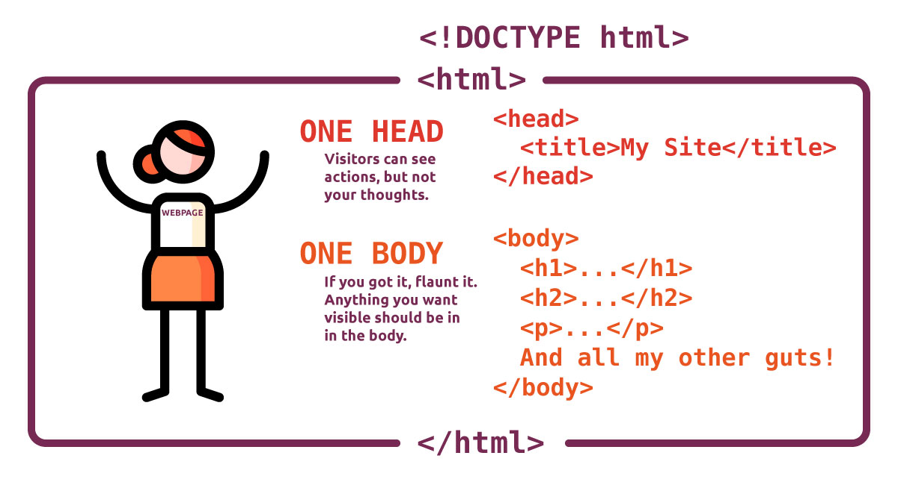

<div class="divider-heading"></div>

Can you see how a single page is similar to how you're structured? **You only have one head and one body, and the head _always_ comes first.**




<div class="divider-pg"></div>


This is the basic layout of an HTML document.


<div id="code-heading">HTML</div>
```html
<!DOCTYPE html>
<html>
  <head>
    <title>My Way-Cool Awesome Site!</title>
    <!-- Meta data and information about your site, not visible to visitors. -->
  </head>

  <body>
    <!-- “My Way-Cool Awesome Site!” contents, visible to visitors. -->
  </body>
</html>
```
