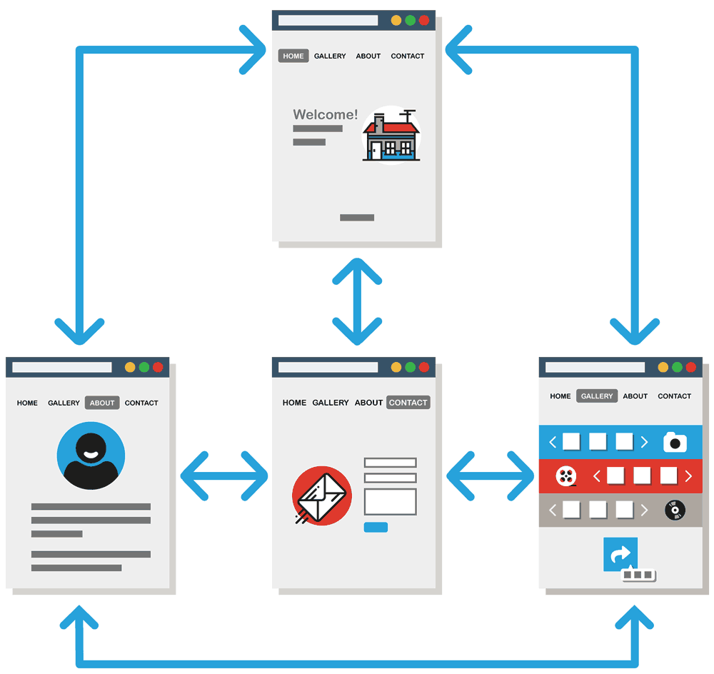

Relative URLs help with building a site locally before pushing it to the web. This way you can develop on your local machine, and still have links to pages be valid. But how do we navigate to a different directory using a relative URL?

Consider this 3-page site, which has an “**index.html**,” an “**about.html**,” and a “**contact.html**,” all of which _link_ (or connect) to each other:

The directory of this site has the **index.html** in the root directory, and the other pages in the child-directory **/pages**:

Directory Tree

<pre id="bash">
.
├── index.html
└── <i class="far fa-folder-open"></i> pages/
    ├── <i class="fab fa-html5"></i> about.html
    └── <i class="fab fa-html5"></i> contact.html
</pre>

I have a menu at the top of each page that needs to link to each of these pages despite what page the visitor is currently on. So how do I do this?

<h2 id="deeper-level-linking">Go Deeper (Forwards)</h2>

  <i class="fas fa-long-arrow-alt-right" style="color: #DF382C"></i>
  From Index to About: <code>&lt;a href="./pages/about.html"&gt;About Me&lt;/a&gt;</code>

This process may look familar, as you've been doing it with screenshots located in an **images** directory. When “going deeper” into our directory, we must add any additional sub-directories (folders) to our URL path, like `<a href="./folder-name/page-name.html"`

Directory Tree

<pre id="bash">
.
├── index.html
└── <i class="far fa-folder-open"></i> pages/
    ├── <i class="fab fa-html5"></i> about.html
    └── <i class="fab fa-html5"></i> contact.html
</pre>

<h2 id="same-level-linking">Same-Level</h2>

  <i class="fas fa-long-arrow-alt-right" style="color: #DF382C"></i>
  From About to Contact: <code>&lt;a href="./contact.html"&gt;Contact Me&lt;/a&gt;</code>

A single `./` states that we need to stay in the current level of our directory. If two pages are on the same level of a directory, the link would simply be `<a href="./page-name.html">`.

Directory Tree

<pre id="bash">
.
├── index.html
└── <i class="far fa-folder-open"></i> pages/
    ├── <i class="fab fa-html5"></i> about.html
    └── <i class="fab fa-html5"></i> contact.html
</pre>

<h2 id="shallower-level-linking">Go Shallower (Backwards)</h2>

  <i class="fas fa-long-arrow-alt-right" style="color: #DF382C"></i>
  From Contact to Index: <code>&lt;a href="../"&gt;Back to Home&lt;/a&gt;</code>

Not only can we go deeper, but we can also take steps backwards, going higher up in our directory. A link for this direction would look something like `<a href"../page-name.html">`.

If a single `./` states that we need to remain in the current level of our directory heirarchy, two `../` is effectively saying “to find this file, begin here and then step back a directory.”

Directory Tree

<pre id="bash">
.
├── index.html
└── <i class="far fa-folder-open"></i> pages/
    ├── <i class="fab fa-html5"></i> about.html
    └── <i class="fab fa-html5"></i> contact.html
</pre>

Note You will never have more than two “dots” in a path segment. Further stepping may look something like this: `../../../images/profile.png`
