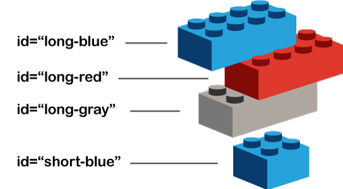

<div class="divider-heading"></div>

There are a number of attributes that are valid for every element. The first that we will discuss is technically called the “global identifier,” but we will refer to it as the **id attribute**.

<div class="container-row">
  

  <p>Following from the idea of identification labels, the “id” attribute takes as its value a string, which should be a <b>unique</b> identifier to that specific element.</p>

  <p>To declare the id attribute of an element, use the standard <code>key="value"</code> syntax for HTML elements.</p>
</div>


<span class="label label-danger">Important</span> The id given to one element should be <u>different</u> from every other elements' id on the page!


<div id="code-heading">HTML</div>
```html
<div id="a-unique-id"></div>

<div id="another-unique-id"></div>
```


You should get in the habit of adding id attributes to any important HTML elements or elements that you may want to style independently. The id attribute is one of the ways that we will select elements via CSS to dictate the style and look of our webpages.


<div class="container-row">
  <div class="lightbulb">
     <svg viewBox='0 0 64 64'>
       <g>
         <line x1='32' y1='16' x2='32' y2='0' />
         <line x1='41.40' y1='19.05' x2='50.80' y2='6.11' />
         <line x1='47.21' y1='27.05' x2='62.43' y2='22.11' />
         <line x1='47.21' y1='36.94' x2='62.43' y2='41.88' />
         <line x1='16.78' y1='36.94' x2='1.56' y2='41.88' />
         <line x1='16.78' y1='27.05' x2='1.56' y2='22.11' />
         <line x1='22.59' y1='19.05' x2='13.19' y2='6.11' />
       </g>
     </svg>

     <i class="far fa-lightbulb"></i>
     <i class="fas fa-lightbulb blink"></i>
  </div>
  <p><span class="remember-text">Remember?</span><br/>
  Using ids is needed when you want to create a link that “jumps” to a <a href="../../topic-04/same-page" target="_blank">specific area of a page</a>.</p>
</div>


<div class="divider-pg"></div>


## Naming Practices for ids
In HTML, the following style guide and naming conventions should be used for ids:

- _HTML Value Quotation Marks_ - You should surround your id value using double quotation marks (as opposed to single).
- _ID Naming_ - Use meaningful id names that reflect the purpose of the element in question, like "contact" rather than "paragraph4".
- _Acceptable Characters_ - Technically, in HTML5, id names must contain at least one character and no spaces. Which leaves all [UTF-8](https://www.w3schools.com/charsets/ref_html_utf8.asp) characters as options. (i.e. `a-z`, `A-Z`, `0-9`, "`_`", "`-`", "`:;,?!@#$%^&*+`", etc.).

However, due to issues that can arise in element selection with CSS and JavaScript, you should follow a more restrictive naming conventions. These conventions are also intended to lend consistency to code between pages and developers, as well as increase readability.

1. Use lowercase letters or number (i.e. `a-z` and `0-9`).
2. Start an id name with a lowercase letter.
3. Use hyphens ("`-`") to separate words (as opposed to underscores "`_`" or [camelCase](https://en.wikipedia.org/wiki/Camel_case)).


<div id="code-heading">HTML</div>
```html
<!-- Recommended: -->
<div id="use-double-quotations">
<div id="contact">
<div id="image-gallery-1">

<!-- Bad Style: -->
<div id='do-not-use-single-quotations'>
<div id='paragraph4'>
<div id='Image_Gallery-1!'>
```

<span class="label label-info">Note</span> You should use id names that are as short as possible, but as long as necessary. The goal is to clearly convey what the element is without being unnecessarily verbose.
