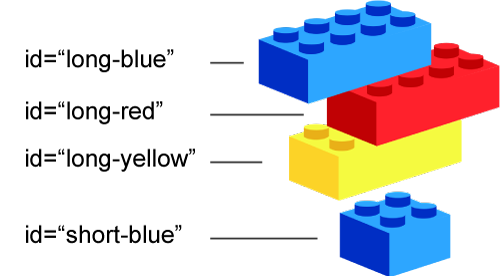

<div class="divider-heading"></div>

There are a number of attributes that are valid for every element. The first that we will discuss is technically called the “Global Attribute,”
however we will refer to it as the **id attribute**.

<div class="container-row">
  

  <p>Following from the idea of identification labels, the 'id' attribute takes as its value a string, which should be a _unique identifier_ to that specific element; as in, <i>the ID given to one element should be different from every other elements' ID on a page</i>.</p>

  <p>To declare the 'id' attribute of an element, use the standard <code>key="value"</code> syntax for HTML elements.</p>
</div>


<div id="code-heading">HTML</div>
```html
<div id="a-unique-id"></div>

<div id="another-unique-id"></div>
```


You should get in the habit of adding ID attributes to any important HTML elements or elements that you may want to style independently. The ID attribute is one of the ways that we will select elements via CSS to dictate the style and look of our webpages.

<div class="container-row">
  <div class="lightbulb">
     <svg viewBox='0 0 64 64'>
       <g>
         <line x1='32' y1='16' x2='32' y2='0' />
         <line x1='41.40' y1='19.05' x2='50.80' y2='6.11' />
         <line x1='47.21' y1='27.05' x2='62.43' y2='22.11' />
         <line x1='47.21' y1='36.94' x2='62.43' y2='41.88' />
         <line x1='16.78' y1='36.94' x2='1.56' y2='41.88' />
         <line x1='16.78' y1='27.05' x2='1.56' y2='22.11' />
         <line x1='22.59' y1='19.05' x2='13.19' y2='6.11' />
       </g>
     </svg>

     <i class="far fa-lightbulb"></i>
     <i class="fas fa-lightbulb blink"></i>
  </div>
  <p><span class="remember-text">Remember?</span><br/>
  There are very important <a href="../../topic-02/naming" target="_blank">naming conventions</a> that you should know by now.</p>
</div>
