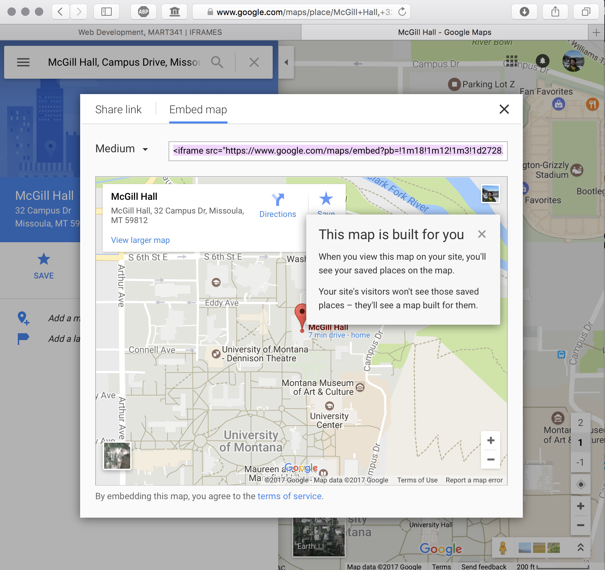

<div class="divider-heading"></div>

In addition to displaying other webpages in the main webpage, the iframe element is often used to display two specific types of instances, like including a Google Map.


<div id="code-heading">HTML</div>
```html
<iframe src="https://www.google.com/maps/embed?pb=!1m18!1m12!1m3!1d2728.0480614643734!2d-113.98579748449639!3d46.862426579142344!2m3!1f0!2f0!3f0!3m2!1i1024!2i768!4f13.1!3m3!1m2!1s0x535dcc33c3d4cbd5%3A0xd77cd4f46bdf5b89!2sMcGill+Hall%2C+32+Campus+Dr%2C+Missoula%2C+MT+59812!5e0!3m2!1sen!2sus!4v1540005742152" width="600" height="450" frameborder="0" style="border:0" allowfullscreen></iframe>
```


<div class="external-embed" style="width: 600px; margin: auto;">
  <iframe src="https://www.google.com/maps/embed?pb=!1m18!1m12!1m3!1d2728.0480614643734!2d-113.98579748449639!3d46.862426579142344!2m3!1f0!2f0!3f0!3m2!1i1024!2i768!4f13.1!3m3!1m2!1s0x535dcc33c3d4cbd5%3A0xd77cd4f46bdf5b89!2sMcGill+Hall%2C+32+Campus+Dr%2C+Missoula%2C+MT+59812!5e0!3m2!1sen!2sus!4v1540005742152" width="600" height="450" frameborder="0" style="border:0" allowfullscreen></iframe>
</div>


<div class="divider-pg"></div>


## How-To:
From the Google maps page, after completing a search, you can click the “share” button. This opens a separate pop-up, where you should select the "Embed map" option. You can then tweak the display options, and copy Google's iframe code to include on your site.





Including this code on your site will create an embedded Google Map that your visiting users may interact with. Typically, this is useful in showing where a business location is.
