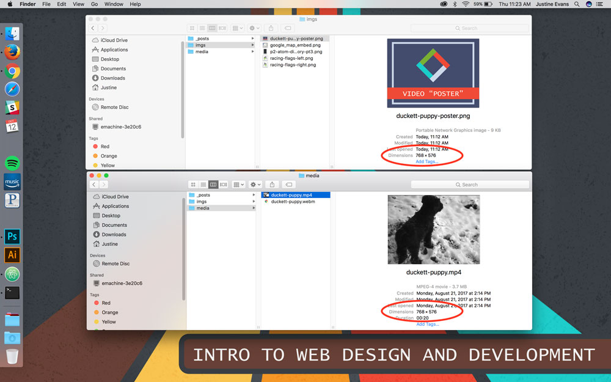

The **poster attribute** (`poster="#"`) should always be supplied with the `<video>` element. This attribute takes a URL as its value, which should point to an image that is displayed in place of the video until the visitor elects play the video.

## Single-Source

Element Breakdown <i class="fas fa-battery-half"></i>

<pre id="breakdown-block">
<video src="#" poster="#" width="" height="" preload controls></video>
</pre>

## Multiple-Source

Element Breakdown <i class="fas fa-battery-half"></i>

<pre id="breakdown-block">
&lt;video poster="#" width="" height="" preload controls&gt;
   &lt;source src="#" type=""&gt;
   &lt;source src="#" type=""&gt;
&lt;/video&gt;
</pre>

Note The image should be the same width/height ratio as the video element.

