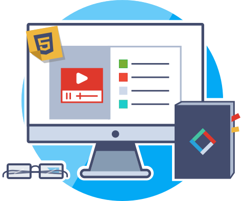

<h2 style="text-align: center;">06: Basic Navigation (Project 2)</h2>

HTML is the workhorse of web languages. You've spent several weeks learning about this as structural dialogue, and now you have the opportunity to put everything you've learned so far into practice.

For Project 2, use your knowledge of HTML and GitHub to create a 3-page “Instructable” (illustrated instruction guide). If you've never utilized an Instructable, explore <a href="https://www.instructables.com/" target="_blank">the Instructables website</a> for ideas on both content and layout!

Think of a topic you know a lot about - an academic study, craft, or favorite recipe, for example - and begin collecting materials. This site will contain:
1. Structural and semantic markup.
2. Well-organized block-style page structure.
2. Images (preferably your own, but sourced is allowed).
4. Embedded media (video, audio, and Google map).
5. Clean, legible coding.

By the end of this Topic, we hope you:
- Have a self-made 3+ page site.
- Showcase an understanding of HTML as markup language.
- Present a cohesive, linear, and complete set of instructions, directions, or other how-to guide through basic structure and styling.
